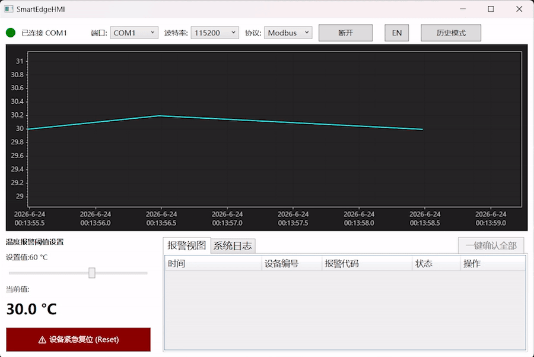
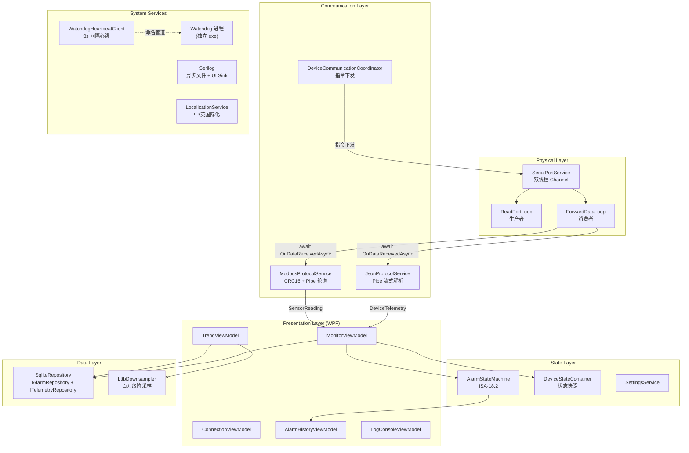
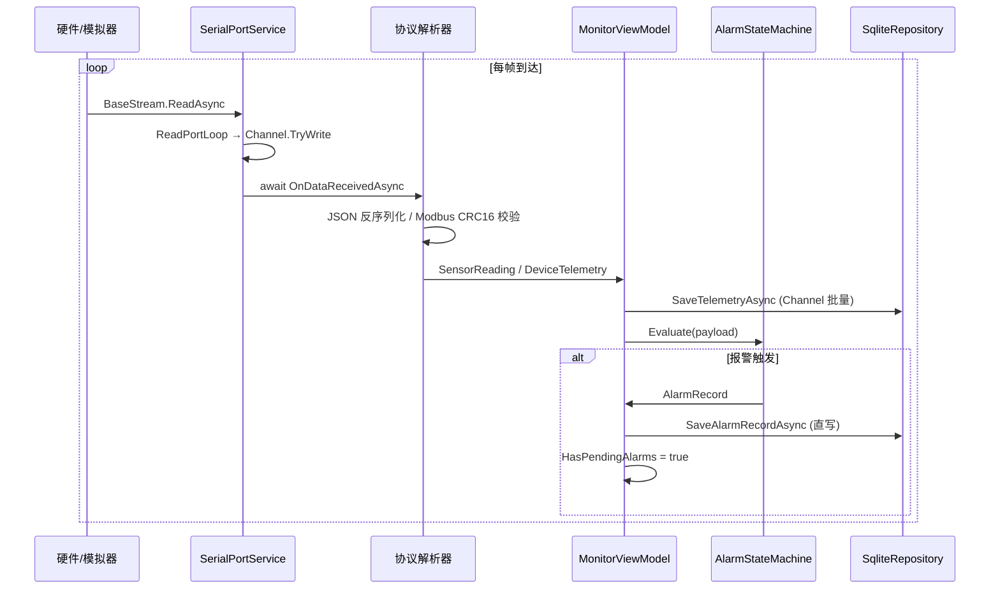
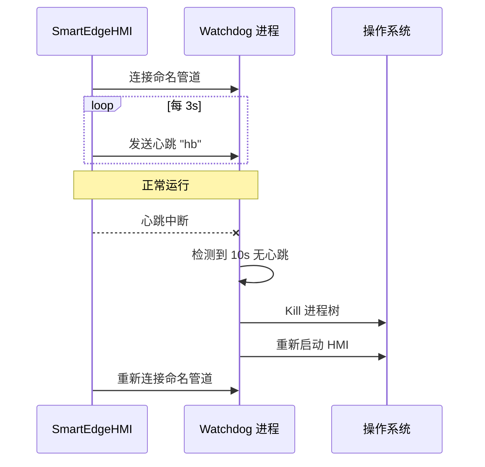

<div align="center">

# SmartEdge-HMI · 工业边缘网关监控系统

<p align="center">
  
  
  
  
  
  <br/>
  
  
  
  
  
</p>

**基于 .NET 8 WPF 构建的工业边缘上位机，具备零分配协议解析、LTTB 百万级降采样与双进程 Watchdog 守护。**

<br/>


<br/><br/>

**[下载 Release(Release v1.0.0)](https://github.com/YiQiuAcc/SmartEdgeHMI/releases/download/v1.0.0/SmartEdgeHMI-v1.0.0-win-x64.zip) | [技术栈](#技术栈) | [完整开发路线](#路线图)**

</div>

<br/>

## 核心特性演示

<table width="100%" style="table-layout: fixed;">
  <tr>
    <th width="50%" align="center">LTTB 海量数据流畅渲染</th>
    <th width="50%" align="center">ISA-18.2 报警状态机交互</th>
  </tr>
  <tr>
    <td align="center"></td>
    <td align="center"></td>
  </tr>
  <tr>
    <td><b>突破性能瓶颈</b>：针对海量历史趋势，底层采用 LTTB 算法，将百万级采样点无损特征压缩，保障 ScottPlot 图表 60FPS 极速渲染。</td>
    <td><b>工业级报警模型</b>：严格遵循 ISA-18.2 国际标准，实现"未确认/已确认/恢复"的完整闭环，并由独立线程安全分发至 UI。</td>
  </tr>
  <tr>
    <th align="center">运行时多语言无缝切换 (i18n)</th>
    <th align="center">Watchdog 守护进程防护</th>
  </tr>
  <tr>
    <td align="center"></td>
    <td align="center"><br/><i>(守护进程为纯后台运行)</i></td>
  </tr>
  <tr>
    <td><b>高度工程化</b>：基于 <code>MarkupExtension</code> 与 <code>ResourceDictionary</code> 实现零闪烁的动态语言切换，无需重启程序。</td>
    <td><b>高可用性保障</b>：主程序与守护进程通过命名管道 (Named Pipe) 维持心跳，实现崩溃秒级自愈与互斥锁 (Mutex) 防呆启动。</td>
  </tr>
</table>

<br/>

## TL;DR · 太长不看

| 特性                    | 说明                                                                                                     |
| ----------------------- | -------------------------------------------------------------------------------------------------------- |
| **双协议实时通信**      | JSON-Lines（Pipe 无锁流式解析）+ Modbus RTU（半字节查表 CRC16），通过 `IProtocolConfig` 接口解耦协议切换 |
| **零分配数据通道**      | `Channel<T>` 解耦串口读/写 + `ArrayPool` 复用缓冲区，零分配粘包处理                                      |
| **百万级趋势渲染**      | LTTB（Largest Triangle Three Buckets）降采样算法，100 万点压缩至 1000 点，首尾保留 + 三角形面积筛选      |
| **边缘触发报警**        | ISA-18.2 状态机（UNACK → ACK → RTN_UNACK → NORMAL），恢复迟滞防抖机制                                    |
| **SQLite WAL 双缓冲**   | Channel 批量入队（50 条 / 1s 窗口）→ 异步事务刷盘，读写分离零锁冲突                                      |
| **Watchdog 双进程守护** | 命名管道心跳检测，主进程无响应时自动强制重启                                                             |
| **全链路异步**          | 从 `BaseStream.ReadAsync` → `Pipe.Writer.WriteAsync` → `ValueTask` 协议解析，零 sync-over-async          |

---

## 架构概览

### 分层架构



### 数据流



---

## 核心功能

### 双协议通信

| 协议           | 数据格式              | 方向                      | 特点                                                   |
| -------------- | --------------------- | ------------------------- | ------------------------------------------------------ |
| **JSON-Lines** | 换行符分隔 JSON       | 设备 → 上位机（主动上报） | `System.IO.Pipelines` 无锁流式解析，`ArrayPool` 零分配 |
| **Modbus RTU** | 03 读/06 写保持寄存器 | 上位机 → 设备（轮询应答） | 半字节查表 CRC16，Pipe 滑动窗口粘包处理，1s 定时轮询   |

### 实时监控

- 连接状态指示灯（红/绿）、COM 口/波特率/协议选择
- ScottPlot 实时曲线图（30 FPS DataLogger）
- 温度报警阈值滑块（防抖保存）、设备紧急复位按钮

### 报警与日志

- **边缘触发报警状态机**（ISA-18.2）：上升沿记录、恢复迟滞计数（3 帧连续正常才判定恢复），防止阈值边界震荡
- 报警数据直写 SQLite，支持按设备/时间段/报警码过滤查询
- 系统日志实时展示，ERROR 级别红色高亮

### 边缘存储

- SQLite WAL 模式 + 临时内存存储
- **遥测双缓冲批量写入**：Channel 收集遥测数据，50 条或 1s 超时触发异步事务提交
- **报警直写**：每条报警实时 INSERT，确保不丢失
- Dapper 类型处理器：`Temperature`/`Humidity`/`DataQuality` 自定义类型处理器自动映射 SQLite 列
- 表结构自动迁移
- LTTB 降采样确保海量历史数据可视化性能

### 双进程 Watchdog

| 组件                      | 角色                 | 技术                                    |
| ------------------------- | -------------------- | --------------------------------------- |
| `SmartEdgeHMI.Watchdog`   | 守护进程（独立 exe） | NamedPipeServerStream，10s 心跳超时检测 |
| `WatchdogHeartbeatClient` | HMI 心跳客户端       | 3s 间隔发送 `"hb"`，自动重连            |



### 值对象

- `Temperature`：摄氏度温标，`FromCelsius` / `FromRawModbus` / 隐式运算符重载
- `Humidity`：百分比湿度，`FromPercent` / `FromRawModbus`
- 与 SQLite 之间通过 Dapper `TypeHandler` 自动转换

---

## 项目结构

```
SmartEdgeHMI/                    # 主应用：入口、DI 容器、全局配置
├── Common/                      # 公共定义：系统常量、设置模型、枚举
├── Communication/               # 通信层：串口服务、Modbus/JSON 协议解析
│   ├── Ports/                   # 串口封装：双线程 Channel 读写
│   └── Protocols/               # 协议实现：JSON-Lines、Modbus RTU + CRC16
├── Data/                        # 数据持久化层：SQLite 仓储 + 报警/遥测实体
│   ├── Entities/                # 数据实体模型
│   └── Repositories/            # 仓储实现（双缓冲批量写入）
├── State/                       # 领域状态层：ISA-18.2 报警状态机、设备状态容器
├── Models/                      # 数据传输层：通信 DTO、消息事件、值对象
│   ├── Dtos/                    # 通信契约（上下行报文）
│   ├── Messages/                # 强类型 Messenger 事件
│   └── ValueObjects/            # 值对象（Temperature、Humidity）
├── ViewModels/                  # MVVM 视图模型：连接/监控/报警/趋势/日志
├── Views/                       # WPF 界面
│   └── Windows/                 # 窗口定义
├── Infrastructure/              # 基础设施：Watchdog 心跳、国际化、日志、降采样
│   ├── Logging/                 # Serilog 异步文件 + WPF UI Sink
│   ├── Math/                    # LTTB 三角形面积降采样
│   └── UI/                      # 批量添加 ObservableCollection
├── Extensions/                  # DI 容器扩展注册
└── Resources/                   # WPF 资源字典（颜色、中/英字符串）

SmartEdgeHMI.Watchdog/           # 独立 Watchdog 守护进程：命名管道、进程监控/重启
SmartEdgeHMI.Tests/              # 单元测试：CRC16、Modbus/JSON 协议、报警状态机（39 个）
Simulator/                       # Node.js 虚拟设备模拟器：JSON + Modbus 双模模拟
```

---

## 快速开始

### 前置条件

- .NET 8 SDK
- Node.js 18+（运行模拟器）
- 虚拟串口软件（如 VSPD、com0com），用于模拟 COM 口对联

### 启动

```bash
# 1. 配置虚拟串口对联（如 COM1 ↔ COM2）

# 2. 启动模拟器（终端 1）
cd Simulator
pnpm install
pnpm run sim:json     # JSON 模式（主动上报，1s/次）
# 或
pnpm run sim:modbus   # Modbus 模式（一问一答）

# 3. 启动 WPF 上位机（终端 2）
dotnet run --project SmartEdgeHMI/SmartEdgeHMI.csproj

# 4. 在 UI 中选择对应 COM 口、波特率 115200，点击连接
```

### 运行单元测试

```bash
dotnet test SmartEdgeHMI.Tests/SmartEdgeHMI.Tests.csproj
# 期望：39 passed，0 failed
```

---

## 技术栈

| 层次     | 技术选型                                                 |
| -------- | -------------------------------------------------------- |
| UI 框架  | WPF (.NET 8)                                             |
| 架构模式 | MVVM（CommunityToolkit.Mvvm 源码生成器）                 |
| 物理通信 | System.IO.Ports（串口）                                  |
| 协议解析 | JSON-Lines、Modbus RTU（半字节查表 CRC16）               |
| 数据通道 | System.Threading.Channels（批量缓冲 + 直接 await）       |
| 实时图表 | ScottPlot.WPF（SkiaSharp 渲染，30 FPS）                  |
| 边缘存储 | SQLite + Dapper（WAL 模式 + TypeHandler）                |
| 日志     | Serilog（异步文件 + WPF UI Sink）                        |
| 依赖注入 | Microsoft.Extensions.DependencyInjection（KeyedService） |
| 进程守护 | System.IO.Pipes（NamedPipeServerStream）                 |
| 配置     | Microsoft.Extensions.Configuration（JSON）               |

---

## 路线图

详见 [ROADMAP.md](ROADMAP.md) — 包含多协议扩展、持久化优化、CI/CD 流水线等规划。
